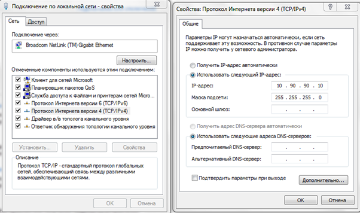
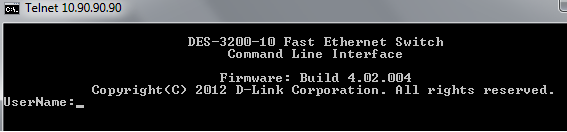
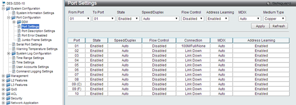

# 1. Коммутатор, средства управления и начальная настройка

## Теоретическая часть

Большинство современных коммутаторов поддерживают различные функции управления и мониторинга. Основные из них:

*   **Дружественный Web-интерфейс управления**
*   **Интерфейс командной строки (Command Line Interface, CLI)**
*   **Удаленное управление по протоколам Telnet и SNMP**

---

### Web-интерфейс управления

Web-интерфейс позволяет осуществлять настройку и мониторинг коммутатора, используя любой компьютер со стандартным веб-браузером. Связь между компьютером (клиентом) и коммутатором (сервером) устанавливается по протоколу **HTTP (HyperText Transfer Protocol)** через **TCP/IP** соединение, как правило, на **80-й порт**.

> **Что такое HTTP?**
> Это протокол прикладного уровня, который изначально использовался для передачи гипертекстовых документов (HTML), а сейчас применяется для передачи произвольных данных.

Главная страница Web-интерфейса предоставляет администратору доступ ко всем настройкам и отображает всю необходимую информацию, включая:

*   статус устройства;
*   статистику производительности;
*   конфигурацию портов и модулей.

В коммутаторах D-Link Web-интерфейс состоит из двух частей:
1.  **GUI (Graphical User Interface)** — графический интерфейс, который запускается на компьютере клиента.
2.  **HTTP-сервер** — программа, которая работает непосредственно на самом коммутаторе.

Web-интерфейс является удобной альтернативой командной строки (CLI), так как предоставляет наглядное графическое представление всех данных в режиме реального времени.

<figure markdown="span">
  { width="600", align="center"} <figcaption>Рисунок 1.1 - Web-интерфейс</figcaption>
</figure>
Связь между клиентом и сервером обычно осуществляется через TCP/IP (Transmission Control Protocol/Internet Protocol, стек протоколов передачи данных, используемых в сетях, включая Интернет) соединение с номером порта НТТР равным 80.

## Лабораторная работа - Средства управления и начальная настройка коммутатора

**Цель:** ознакомиться с основными командами настройки, поиска и устранения неполадок коммутаторов D-Link.

### Подготовка к работе

Для начала выполнения работы необходимо подключить коммутатор к компьютеру:

1.  Соедините сетевым кабелем компьютер и LAN–порт коммутатора.
2.  В свойствах сети компьютера настройте подключение в соответствии с рис. 1.2.
3.  Подключитесь к коммутатору через web–интерфейс, используя браузер. Для этого в адресной строке браузера введите http://10.90.90.90:80 (при заводских настройка IP–адрес коммутатора DES–3200–10 – 10.90.90.90)

<figure markdown="span">
  { width="600", align="center" }<figcaption>Рисунок 1.2 – Настройка подключения</figcaption>
</figure>

### 1. Авторизация в Web-интерфейсе

В появившемся окне авторизации поля Имя пользователя и Пароль необходимо оставить пустыми и нажать кнопку Вход (окно авторизации может меняться в зависимости от используемого браузера), т.к. при заводских настройках не существует не одного пользователя. После этого появится окно Web–интерфейса управления коммутатором.

<figure markdown="span">
  { width="600", align="center" }<figcaption>Рисунок 1.3 - Окно авторизации</figcaption>
</figure>

Условно пользовательский интерфейс можно разделить на 3 области:

*   **Область 1** содержит список папок, объединяющих семейство функций, предназначенных для выполнения той или иной задачи. Например, в папке L2 Features находятся функции 2-го уровня модели OSI, включая 802.1Q VLAN, QinQ, 802.1v Protocol VLAN и т.д.
*   Если щелкнуть кнопкой мыши по одной из папок и выбрать необходимую функцию, то в **области 2** Web–интерфейса появится окно, предназначенное для ввода и/или выбора данных.
*   **Область 3** представляет собой графическое изображение передней панели коммутатора в режиме реального времени. Эта область отражает порты и модули расширения коммутатора и их состояние.

<figure markdown="span">
  { width="600", align="center" }<figcaption>Рисунок 1.4 - Web-интерфейс</figcaption>
</figure>

### 2. Защита от доступа неавторизованных пользователей

Самым первым шагом при создании конфигурации коммутатора является обеспечение его защиты от доступа неавторизованных пользователей. Самая простая форма безопасности – создание учетных записей для пользователей с соответствующими правами. Создавая учетную запись для пользователя, можно задать один из следующих уровней привилегий: Admin, Operator, Power User или User. Учетная запись Admin имеет наивысший уровень привилегий.

<figure markdown="span">
  { width="600", align="center" }<figcaption>Рисунок 1.5 - Меню создания/редактирования аккаунтов</figcaption>
</figure>

Меню создания/редактирования аккаунтов находится в папке System Configuration и называется User Accounts Settings. Для создания пользователя необходимо ввести его Имя, Пароль, указать тип привилегий и выбрать тип шифрования (если шифрование включено). Здесь же можно отредактировать уже имеющиеся аккаунты, сменив пароль или тип шифрования.

!!! example "Задание"
    Cоздайте как минимум по 1 пользователю для каждого типа привилегий и проверьте, какие функции доступны для каждого типа пользователей.

### 3. Настройка времени на коммутаторе

Установка времени необходима для правильного отображения информации в журналах регистрации коммутаторов (Log files), проведения аудита работы сети, мониторинга сети и т.п.

<figure markdown="span">
  { width="600", align="center" }<figcaption>Рисунок 1.6 - Меню настройки времени</figcaption>
</figure>

Меню настройки времени находится в папке System Configuration и называется Time Settings.

!!! example "Задание"
    Установите текущую дату и время.

### 4. Изменение IP-адреса коммутатора

Для того чтобы коммутатором можно было удаленно управлять через Web-интерфейс или Telnet, ему необходимо назначить IP-адрес из адресного пространства сети, в которой планируется его использовать. IP-адрес может быть задан автоматически, с помощью протоколов DHCP или BOOTP, или статически.

<figure markdown="span">
  { width="600", align="center" }<figcaption>Рисунок 1.7 - Меню System IP Address Settings</figcaption>
</figure>

Меню System IP Address Settings находится в Management – IP Interface. Так же здесь можно задать маску подсети, шлюз и указать, в какой VLAN находится коммутатор.

!!! example "Задание"
    Измените IP–адрес коммутатора на 10.90.80.90. Повторите подключение к коммутатору. Результат объясните. (после выполнения задания установите IP–адрес коммутатора – 10.90.90.90)

### 5. Управление доступом через Web-интерфейс и Telnet

Для повышения безопасности сети, в том случае если для доступа к коммутатору не используются Web-интерфейс или Telnet, рекомендуется их отключить (по умолчанию Web-интерфейс и Telnet на коммутаторе включены).

Меню для управления доступом через Web-интерфейс и Telnet находятся в папке Management и называются Web Settings и Telnet Settings соответственно. Так же в этих меню доступно изменение портов подключения для Web-интерфейса (по-умолчанию 80 порт) и Telnet (по-умолчанию 23 порт).

!!! example "Задание"
    Для повышения безопасности было решено изменить порты управления оборудования через Web-интерфейс и Telnet. Измените порт Web-интерфейса на 179, а порт Telnet на 2545. После выполнения задания установите порты по-умолчанию.

#### Подключение через Telnet

Для подключения к коммутатору через Telnet нужно запустить интерпретатор командной строки (cmd.exe).

<figure markdown="span">
  { width="600", align="center" }<figcaption>Рисунок 1.8 - cmd.exe</figcaption>
</figure>

Далее необходимо запустить клиент сетевого протокола для реализации текстового интерфейса по сети (telnet.exe).

<figure markdown="span">
  { width="600", align="center" }<figcaption>Рисунок 1.10 - telnet.exe</figcaption>
</figure>

После с помощью команды `open` или `o` установите Telnet-подключение к коммутатору по IP-адресу 10.90.90.90 и порту 23.

<figure markdown="span">
  { width="600", align="center" }<figcaption>Рисунок 1.11 - Установление Telnet-подключения</figcaption>
</figure>

В случае успешного подключения в окне можно будет увидеть баннер приветствия и строчку, предлагающую ввести имя пользователя.

<figure markdown="span">
  { width="600", align="center" }<figcaption>Рисунок 1.12 - Баннер приветствия</figcaption>
</figure>

Если на данный момент ни одного пользователя не существует, то достаточно оставить строки имени и пароля пустыми. При наличии пользователей необходимо осуществить авторизацию аккаунта с привилегиями Admin.

После авторизации введите команду `disable web` и попробуйте подключиться к коммутатору через Web-интерфейс. При не возможности подключиться через Web-интерфейс введите команду `enable web` через Telnet и повторите подключение через Web-интерфейс. Когда возможность управлять коммутатором через Web-интерфейс будет возвращена, выйдите с помощью команды `logout` из командной строки.

!!! example "Задание"
    Совершите обратную операцию, отключив возможность управления через Telnet, используя Web-интерфейс. Проверьте результат.

### 6. Настройка основных параметров портов коммутатора

По умолчанию порты всех коммутаторов поддерживают автоматическое определение скорости и режима работы (дуплекса). Но может возникнуть ситуация, в которой автоопределение будет действовать некорректно и потребуется ручная установка скорости и режима. В этом случае ручную настройку параметров необходимо выполнить на обоих концах канала связи.

Для установки параметров портов, таких как скорость передачи, дуплексный/полудуплексный режим работы, активизация/отключение управления потоком, изучение МАС-адресов, автоматическое определение полярности и т.д., на коммутаторах можно воспользоваться этим меню.

<figure markdown="span">
  { width="600", align="center" }<figcaption>Рисунок 1.13 - Меню Port Settings</figcaption>
</figure>

Меню настройка параметров портов находится в System Configuration – Port Configuration и называется Port Settings.

!!! example "Задание"
    Установите у всех четных портов скорость равную 10 Мбит, а у нечетных включите потоковый контроль. Порты 9 и 10 не изменять.

### 7. Функция Factory Reset (сброс к заводским установкам)

Меню перезагрузки системы можно вызвать путем открытия выпадающего списка Tools и выбора пункта Reset. Здесь доступны 3 вида перезагрузки:

*   **Reset** - все параметры, за исключением IP-адреса, учетных записей пользователей и Log-файла, будут возвращены к заводским параметрам по умолчанию.
*   **Reset Config** - на коммутаторе восстановятся все заводские настройки по умолчанию, включая IP-адрес интерфейса управления, учетные записи пользователей и журнал регистраций.
*   **Reset System** - на коммутаторе восстановятся все заводские настройки по умолчанию в полном объеме. Коммутатор сохранит эти настройки в энергонезависимой памяти NVRAM и перезагрузится.

<figure markdown="span">
  { width="600", align="center" }<figcaption>Рисунок 1.14 - Меню Reset System</figcaption>
</figure>

!!! example "Задание"
    Восстановить все заводские настройки, используя Reset System.

---

### Контрольные вопросы

  <h4>Вопрос 1: Какие существуют уровни привилегий и какие функции доступны им?</h4>
  

    <label><input type="radio" name="q1" value="a"> Root, User, Guest</label> 
    <label><input type="radio" name="q1" value="b"> Admin, Operator, Power User, User</label> 
    <label><input type="radio" name="q1" value="c"> Manager, Operator, Guest</label> 
    <label><input type="radio" name="q1" value="d"> Super-Admin, Admin, User</label>
  

  <h4>Вопрос 2: Какие порты управления через Web-интерфейс и Telnet используются по умолчанию?</h4>
  

    <label><input type="radio" name="q2" value="a"> Web: 8080, Telnet: 2323</label> 
    <label><input type="radio" name="q2" value="b"> Web: 443, Telnet: 22</label> 
    <label><input type="radio" name="q2" value="c"> Web: 80, Telnet: 23</label> 
    <label><input type="radio" name="q2" value="d"> Web: 80, Telnet: 21</label>
  

  <h4>Вопрос 3: Что такое Telnet?</h4>
  

    <label><input type="radio" name="q3" value="a"> Протокол для автоматической настройки IP-адреса.</label> 
    <label><input type="radio" name="q3" value="b"> Протокол для безопасной передачи файлов.</label> 
    <label><input type="radio" name="q3" value="c"> Протокол для текстового удаленного управления устройством через сеть.</label> 
    <label><input type="radio" name="q3" value="d"> Протокол для передачи голосового трафика.</label>
  

  <h4>Вопрос 4: Зачем нужно настраивать время на сетевом оборудовании?</h4>
  

    <label><input type="radio" name="q4" value="a"> Для ускорения обработки пакетов.</label> 
    <label><input type="radio" name="q4" value="b"> Для корректной работы журналов (логов), аудита и мониторинга.</label> 
    <label><input type="radio" name="q4" value="c"> Для увеличения пропускной способности портов.</label> 
    <label><input type="radio" name="q4" value="d"> Для автоматического определения скорости соединения.</label>
  

  <button class="md-button md-button--primary" onclick="checkQuiz('quiz-lab1', {'q1': 'b', 'q2': 'c', 'q3': 'c', 'q4': 'b'})">Проверить ответы</button>
  

