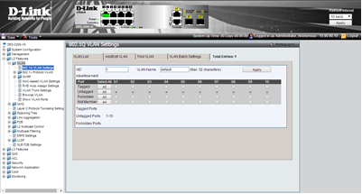

# 1. Коммутатор, средства управления и начальная настройка

## Теоретическая часть

Большинство современных коммутаторов поддерживают различные функции управления и мониторинга. Основные из них:

*   **Дружественный Web-интерфейс управления**
*   **Интерфейс командной строки (Command Line Interface, CLI)**
*   **Удаленное управление по протоколам Telnet и SNMP**

---

### Web-интерфейс управления

Web-интерфейс позволяет осуществлять настройку и мониторинг коммутатора, используя любой компьютер со стандартным веб-браузером. Связь между компьютером (клиентом) и коммутатором (сервером) устанавливается по протоколу **HTTP (HyperText Transfer Protocol)** через **TCP/IP** соединение, как правило, на **80-й порт**.

> **Что такое HTTP?**
> Это протокол прикладного уровня, который изначально использовался для передачи гипертекстовых документов (HTML), а сейчас применяется для передачи произвольных данных.

Главная страница Web-интерфейса предоставляет администратору доступ ко всем настройкам и отображает всю необходимую информацию, включая:

*   статус устройства;
*   статистику производительности;
*   конфигурацию портов и модулей.

В коммутаторах D-Link Web-интерфейс состоит из двух частей:
1.  **GUI (Graphical User Interface)** — графический интерфейс, который запускается на компьютере клиента.
2.  **HTTP-сервер** — программа, которая работает непосредственно на самом коммутаторе.

Web-интерфейс является удобной альтернативой командной строки (CLI), так как предоставляет наглядное графическое представление всех данных в режиме реального времени.

{ width="600", align="center" }

---

### Интерфейс командной строки (CLI)

**CLI (Command Line Interface)** — это мощный инструмент для управления коммутатором через текстовые команды. Он часто используется опытными администраторами для автоматизации настройки и выполнения сложных задач, где графический интерфейс может быть медленнее или менее гибким.

---

### Удаленное управление (Telnet и SNMP)

*   **Telnet:** Протокол для удаленного доступа к командной строке устройства.
*   **SNMP (Simple Network Management Protocol):** Протокол для мониторинга и управления сетевыми устройствами. Позволяет собирать статистику и изменять настройки централизованно.